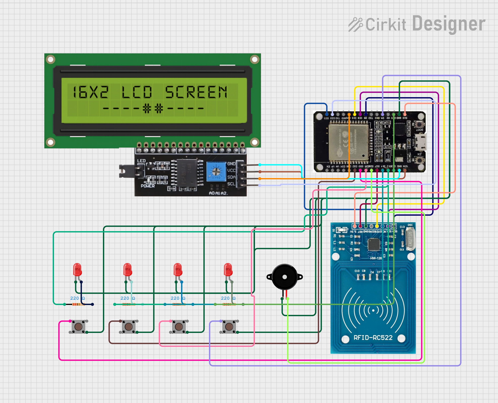

# RFID-RF-Based-E-Voting-System
Smart RFID &amp; RF-based E-Voting system using ESP32, RC522, LCD, and Google Sheets. Features real-time vote logging, admin result view, countdown timer, and voter feedback with LEDs &amp; buzzer. Ideal for PBL projects and IoT-based secure voting prototypes.

# 📡 RFID & RF Based E-Voting System

A smart and secure **IoT-based voting system** built with **ESP32**, **RFID**, and **Google Sheets** integration. Designed for real-time vote logging, result summarization, and LED/Buzzer feedback – perfect for academic projects, demo elections, and secure e-voting prototypes.

---

## 👨‍💻 Developed By

- Tejas Bhalchandra Kole  
- Harsh Rakesh Kolhe  
- Tejas Atul Kotgire  
- Shraddha Vijay Kshirsagar  

---

## 🔧 Features

- ✅ RFID card-based voter authentication  
- ✅ Google Sheets integration via Apps Script  
- ✅ Real-time vote logging with timestamp and status  
- ✅ Voting enabled only once per card  
- ✅ Admin/master card shows:
  - Vote Summary (with line-break party votes)
  - Total votes and declared **Winner**  
- ✅ LCD displays voter messages + 10s countdown  
- ✅ Auto timeout if no button is pressed  
- ✅ LED and Buzzer feedback for each action  
- ✅ Displays **Welcome message** on card scan  
- ✅ Serial Monitor logs total vote count  
- ✅ Handles **tie** and **no-vote** cases smartly

---

## 📦 Components Used

- ESP32 Wroom-32  
- RC522 RFID Reader  
- 16x2 LCD with I2C  
- Buzzer  
- 5 LEDs + 220Ω resistors  
- Push buttons for parties  
- Google Apps Script (connected with Google Sheet)  
- Arduino IDE

---

## 🔌 Simulation Files

- ⚡ [⚡ Download Circuit Simulation (.ckt)](Docs/Simulations/RFID%20%26%20RF%20Based%20E-Voting%20System.ckt)

## 📸 Project Showcase

### 🔌 Circuit Diagram:

### 🧪 Real-Time Setup:

---

## ▶️ [📹 Watch Project Demo on YouTube](https://youtube.com/shorts/w2tXMks05K4?si=k-z5knKSpe7Tq8rl)

---

## ⚙️ Setup Instructions

1. 🔧 **Connect all components** as per the circuit diagram.
2. 💻 **Upload Arduino code** to ESP32 via Arduino IDE.
3. 🌐 Create a **Google Sheet** and connect it using a Google Apps Script (Webhook URL).
4. 🔑 Assign a **Master/Admin RFID card** (used to view summary).
5. 🎮 Each button corresponds to a party:  
   - Press button after card scan to vote  
6. ⏳ **10-second countdown** auto-exits if no vote is cast.
7. ✅ LCD shows welcome, vote status, summary, and winner.

---

## 🗳️ How It Works

- Voter scans RFID card → gets welcome message
- Chooses party via button → vote is logged in Google Sheet
- LED & Buzzer confirm action  
- If card already used → message + double beep  
- Admin card displays:
  - Party-wise vote summary  
  - Winner  
  - Total votes  
  (Also logs it to a new Google Sheet row)

---

## 🧾 License

This project is licensed under the **MIT License** – free to use, share, and modify with credit.  
See the [LICENSE](LICENSE) file for details.

---

## 🌟 Made with love & logic by engineering students 💡🇮🇳

